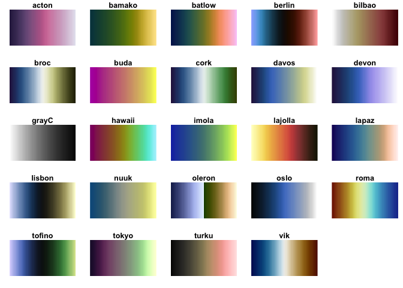

<!-- README.md is generated from README.Rmd. Please edit that file -->

# scico 

<!-- badges: start -->

[](https://github.com/thomasp85/scico/actions/workflows/R-CMD-check.yaml)
[](https://CRAN.R-project.org/package=scico)
[](https://app.codecov.io/gh/thomasp85/scico?branch=main)
<!-- badges: end -->

This is a small package to provide access to the colour palettes
developed by Fabio Crameri and published at
<http://www.fabiocrameri.ch/colourmaps.php>. It uses more or less the
same api as [`viridis`](https://github.com/sjmgarnier/viridis) and
provides scales for [`ggplot2`](https://github.com/tidyverse/ggplot2)
without requiring `ggplot2` to be installed.

## Installation

`scico` can be installed from CRAN with `install.packages('scico')`. If
you want the development version then install directly from GitHub:

``` r
# install.packages("devtools")
devtools::install_github("thomasp85/scico")
```

## Palettes

`scico` provides 35 different palettes, all of which are perceptually
uniform and colourblind safe. An overview can be had with the
`scico_palette_show()` function:

``` r
library(scico)

scico_palette_show()
```

<!-- -->

Once you’ve decided on a palette you can generate colour values using
the `scico()` function:

``` r
scico(30, palette = 'lapaz')
#>  [1] "#190C65" "#1D196C" "#1E2575" "#202F7D" "#223A85" "#25448B" "#274E92"
#>  [8] "#2A5898" "#2E629D" "#336CA1" "#3774A3" "#3F7DA5" "#4886A6" "#528EA6"
#> [15] "#5F95A5" "#6C9AA3" "#7A9E9F" "#87A19A" "#95A494" "#A2A58F" "#ADA78B"
#> [22] "#BBA989" "#CAAD8A" "#DBB592" "#EBC0A0" "#F6CCB0" "#FBD7C2" "#FDE0D2"
#> [29] "#FFEAE2" "#FFF2F2"
```

## ggplot2 support

`scico` provides relevant scales for use with `ggplot2`. It only
suggests `ggplot2` in order to stay lightweight, but if `ggplot2` is
available you’ll have access to the `scale_[colour|fill]_scico()`
functions:

``` r
library(ggplot2)
volcano <- data.frame(
  x = rep(seq_len(ncol(volcano)), each = nrow(volcano)),
  y = rep(seq_len(nrow(volcano)), ncol(volcano)),
  height = as.vector(volcano)
)
ggplot(volcano, aes(x = x, y = y, fill = height)) + 
  geom_raster() + 
  scale_fill_scico(palette = 'davos') 
```

<!-- -->

## References

-   Crameri, Fabio. (2021, September 12). *Scientific colour maps (Version
    7.0.1)*. Zenodo. doi: 10.5281/zenodo.5501399   
    
-   Crameri, Fabio. (2018). *Geodynamic diagnostics, scientific
    visualisation and StagLab 3.0*. Geosci. Model Dev. Discuss. doi:
    10.5194/gmd-2017-328
